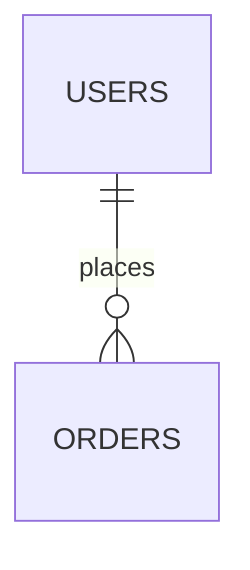

# Agentic Project Docs

> **Agent context:** Use this skill when starting a new software project or when a project needs a full documentation overhaul. Interview the user first, then generate the complete docs bundle. The output is a folder of markdown files that any AI agent can use to build the project sprint-by-sprint without losing context.

---

## When to Use This Skill

- User says "start a new project" or "help me build X"
- A project exists but has no structured documentation
- Before handing off a project to another AI agent session
- When the project docs are out of date and causing hallucination

---

## Step 1 — Interview the User

Before writing anything, gather these inputs in a single message:

```
1. Project name & one-line description
2. Core actors/roles (e.g. Guest, User, Admin, Seller)
3. Main feature modules (e.g. Auth, Product, Order, Payment)
4. Tech stack:
   - Backend language/framework (e.g. Laravel, Django, Express, NestJS)
   - Database (e.g. MySQL, PostgreSQL, MongoDB)
   - Cache/Queue (e.g. Redis, RabbitMQ) — optional
   - File storage (e.g. S3, GCS, local) — optional
   - Auth method (e.g. JWT, Sanctum, OAuth)
5. MVP scope — which features must ship first?
6. Any special flows? (e.g. marketplace payout, multi-tenancy, real-time)
```

If the user's prompt already contains most of this, extract answers directly and confirm briefly before generating.

---

## Step 2 — Generate the Documentation Bundle

Create this file structure under `{project-slug}-docs/`:

```
{project-slug}-docs/
├── AGENT_QUICK_REF.md          ← Navigation map (generate last)
├── README.md                   ← Project overview, quick-start, actor table
├── architecture/
│   ├── SYSTEM_OVERVIEW.md      ← Architecture diagram, request lifecycle
│   ├── PROJECT_STRUCTURE.md    ← Full directory tree, naming conventions
│   └── DESIGN_PATTERNS.md      ← Patterns used (with copy-paste code)
├── database/
│   ├── SCHEMA.md               ← ERD (Mermaid), table specs, status flows
│   └── MIGRATIONS.md           ← Full migration code
├── api/
│   └── API_REFERENCE.md        ← All endpoints, request/response, error codes
├── modules/
│   ├── MODULES_OVERVIEW.md     ← Module responsibility matrix
│   └── FEATURE_FLOWS.md        ← End-to-end flows as numbered steps
├── devops/
│   └── DOCKER.md               ← docker-compose, Dockerfiles, env config
└── sprints/
    ├── SPRINT_PLAN.md          ← Roadmap table, MVP definition, DoD
    ├── SPRINT_01.md            ← Foundation & Auth
    ├── SPRINT_02.md            ← Core feature module
    ├── SPRINT_03.md            ← Transactions / core flow
    ├── SPRINT_04.md            ← Secondary features
    └── SPRINT_05.md            ← Admin, reporting, polish
```

---

## Step 3 — File Writing Standards

Every file MUST:

**Rule 1 — Agent Context Header:**
```markdown
# {File Title}

> **Agent context:** {1-2 sentences: what this file is for, when to read it.}
```

**Rule 2 — ASCII Architecture Diagrams** in SYSTEM_OVERVIEW.md:
```
┌──────────┐     ┌──────────┐     ┌──────────┐
│  Client  │────►│  Nginx   │────►│  App     │
└──────────┘     └──────────┘     └──────────┘
```

**Rule 3 — Mermaid ERD** in SCHEMA.md:


**Rule 4 — Copy-paste ready code** in DESIGN_PATTERNS.md — no `// TODO` stubs.

**Rule 5 — Acceptance criteria as terminal commands** in sprint tasks:
```bash
curl -X POST http://localhost:8000/api/v1/auth/login \
  -d '{"email":"test@test.com","password":"Test@123"}'
# Expected: 200 with token
```

**Rule 6 — Cross-references** using exact file paths:
```markdown
**Ref:** `architecture/DESIGN_PATTERNS.md`, `database/SCHEMA.md`
```

---

## Step 4 — Generate AGENT_QUICK_REF.md Last

After all other files are written, create the master index. It must include:
1. Navigation map table (I want to do X → read file Y)
2. All critical rules in one place
3. Naming conventions quick reference
4. Docker quick commands
5. Pre-sprint checklist

---

## Step 5 — Present Output

```bash
zip -r {project-slug}-docs.zip {project-slug}-docs/
```

Present to user:
1. The `.zip` archive
2. `AGENT_QUICK_REF.md`
3. `README.md`
4. `sprints/SPRINT_PLAN.md`

---

## Output / Deliverables

- Complete `{project-slug}-docs/` folder (15+ markdown files)
- `.zip` archive for download
- All files have `> Agent context:` header
- All sprint tasks have acceptance criteria as runnable commands

---

## Quality Checklist

- [ ] Every file has `> **Agent context:**` header
- [ ] SCHEMA.md has Mermaid ERD block
- [ ] DESIGN_PATTERNS.md has copy-paste code for each pattern
- [ ] Every sprint task has acceptance criteria with terminal commands
- [ ] AGENT_QUICK_REF.md navigation map covers ALL files
- [ ] README.md has quick-start commands that work
- [ ] Status flows shown as ASCII state machines
- [ ] Module responsibility table is complete
- [ ] AGENT_QUICK_REF.md generated last
