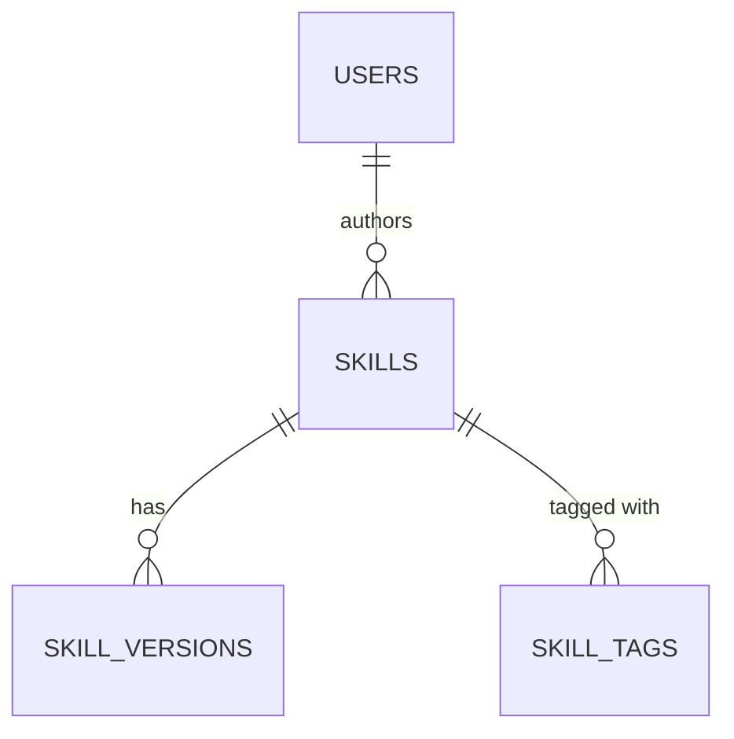

# DB Schema Designer

> **Agent context:** Use this skill before changing any database schema. Design the table first (ERD + column specs), then write the Drizzle schema, then the migration. Never alter production schema without a migration file.

---

## When to Use This Skill

- Adding a new table to the registry database
- Adding columns to an existing table
- Changing column types or constraints
- Adding indexes for query performance

---

## Step 1 — Design the ERD

Sketch the entity relationships before writing code:

```
skills ||--o{ skill_versions : "has"
users  ||--o{ skills : "authors"
users  ||--o{ tokens : "has"
```

Define for each table:
- Primary key strategy (UUID text vs integer autoincrement)
- Foreign key relationships
- Required vs nullable columns
- Indexes needed for common queries

---

## Step 2 — Write the Drizzle Schema

Following the pattern in `packages/registry/src/db/schema.ts`:

```typescript
import { sqliteTable, text, integer } from 'drizzle-orm/sqlite-core';

export const skillTags = sqliteTable('skill_tags', {
  id: text('id').primaryKey(),              // UUID
  skillId: text('skill_id')
    .notNull()
    .references(() => skills.id, { onDelete: 'cascade' }),
  tag: text('tag').notNull(),
  createdAt: text('created_at').notNull(),
});

// Add index for common query pattern:
export const skillTagsSkillIdx = index('skill_tags_skill_idx')
  .on(skillTags.skillId);
```

**Rules:**
- Use `text` for IDs (UUIDs), dates (ISO string), and JSON blobs
- Use `integer` for counts and booleans (0/1)
- Use `real` for floats
- All timestamps as ISO string in `text` columns
- All foreign keys declare `references()` with `onDelete` strategy

---

## Step 3 — Write the Migration

```typescript
// packages/registry/src/db/migrations/0002_add_skill_tags.ts
import { sql } from 'drizzle-orm';

export const up = sql`
  CREATE TABLE IF NOT EXISTS skill_tags (
    id TEXT PRIMARY KEY,
    skill_id TEXT NOT NULL REFERENCES skills(id) ON DELETE CASCADE,
    tag TEXT NOT NULL,
    created_at TEXT NOT NULL
  );
  CREATE INDEX IF NOT EXISTS skill_tags_skill_idx ON skill_tags(skill_id);
`;

export const down = sql`
  DROP INDEX IF EXISTS skill_tags_skill_idx;
  DROP TABLE IF EXISTS skill_tags;
`;
```

---

## Step 4 — Update Schema Documentation

If adding significant new tables, add a Mermaid ERD update to `database/SCHEMA.md`:

```markdown

```

---

## Output / Deliverables

- Updated `packages/registry/src/db/schema.ts`
- New migration file in `packages/registry/src/db/migrations/`
- ERD updated in docs if tables are significant

---

## Quality Checklist

- [ ] All foreign keys have `references()` with `onDelete` strategy
- [ ] IDs use `text` (UUID), not `integer` autoincrement
- [ ] Timestamps stored as ISO text strings
- [ ] Migration has both `up` and `down` SQL
- [ ] Migration is numbered sequentially (`000N_description.ts`)
- [ ] Common query paths have indexes
